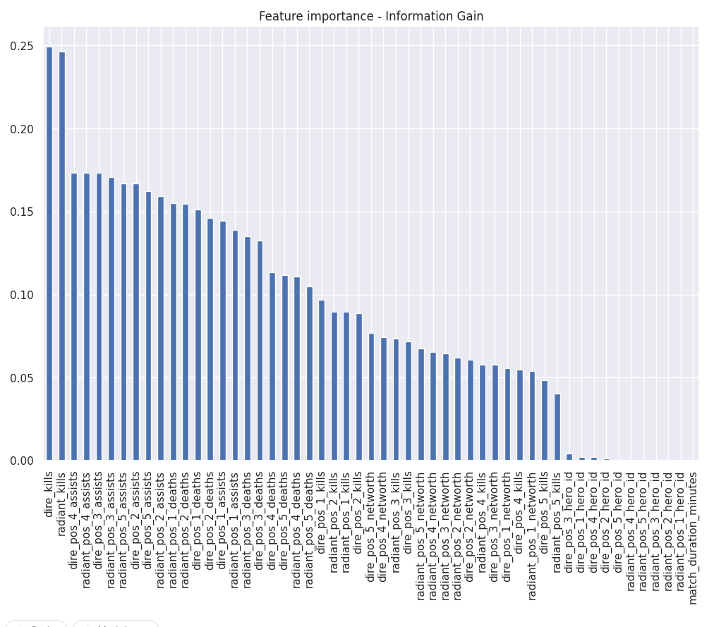
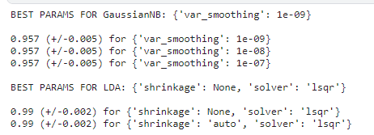
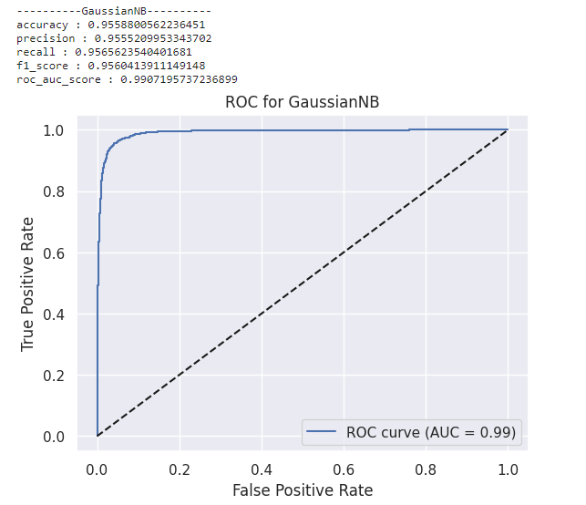
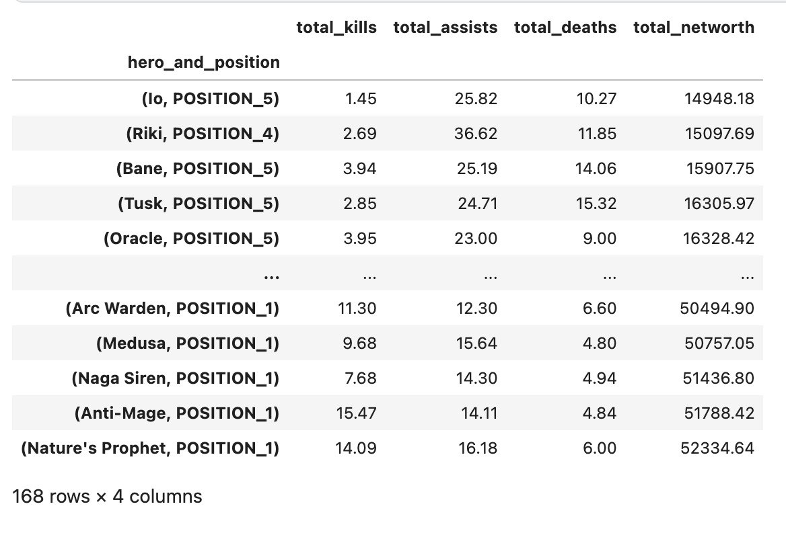
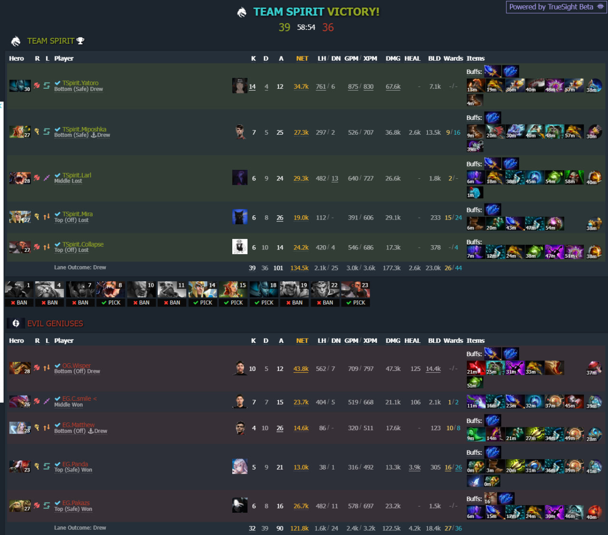
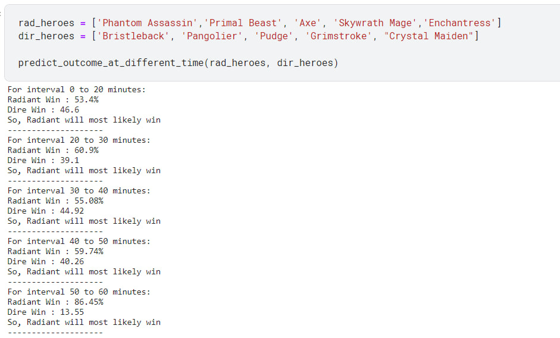

# Dota 2 Match Outcome Prediction

This repository contains a single comprehensive Jupyter Notebook aimed at predicting the outcome of Dota 2 matches. The dataset used for training and testing consists of 160,000 entries with 130 features.

## Notebook Overview

The notebook is structured into several sections, covering various stages of the prediction process:

1. **Exploratory Data Analysis (EDA):** Conducted to gain insights into the dataset, this section explores the distribution of features, identifies patterns, and detects any anomalies present.

2. **Missing Value Handling:** This section addresses missing values in the dataset through appropriate strategies such as imputation or removal, ensuring the integrity of the data.

3. **Feature Engineering:** To improve the model's predictive power, this section focuses on feature transformations and encoding techniques for nominal and ordinal categorical features.

4. **Dataset Shuffling:** In order to prevent bias arising from the order of 'dire' and 'radiant' teams, the dataset is shuffled. This guarantees that swapping team labels does not lead to significantly different outcomes.

5. **Feature Selection:** Based on correlation analysis and information gain, this section performs feature selection to identify the most relevant features for the prediction task.

6. **Discriminative Classifiers - Naive Bayes (NB) and Linear Discriminant Analysis (LDA):** NB and LDA are chosen as the discriminative classifiers for predicting match outcomes due to their effectiveness and efficiency. Additionally, Principal Component Analysis (PCA) is applied to Gaussian NB and LDA to further enhance their performance.

7. **Hyperparameter Tuning and Preliminary Metrics Results:** This section focuses on hyperparameter tuning to optimize the selected models. The performance of the tuned models is evaluated using metrics such as accuracy, precision, recall, F1 score, and ROC AUC. 

## Application

The developed model predicts the outcome of Dota 2 matches based on data from already finished games. A novel approach is introduced to enhance the predictions. Historical data on kill/assist/death/networth statistics for each hero is utilized to calculate their expected average values for different time periods during the game. The expected values are also role-specific.

For example, IO played as a Core hero is expected to have more kills and fewer deaths compared to IO in a support role. Please refer to the provided screenshot for a visual representation.

## Final Result

Given the list of *`'dire'`* and *`'radiant'`* heroes, the model predicts the probability of outcomes for each time frame of the game:

- 0 to 20 minutes
- 20 to 30 minutes
- 30 to 40 minutes
- 40 to 50 minutes
- 50 to 60 minutes
- 60 minutes and beyond

We have tested the model using real-world-pro matches from **The International (TI)**. In the example below, you may find **TI12** match - *`Team Spirit`* vs *`Evil Geniuses`* outcome predictions:
 
